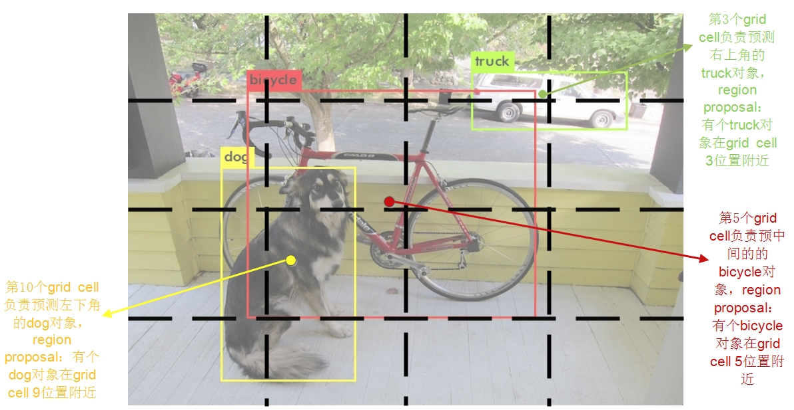

# 关于YOLO(v3)算法，你想知道的全在这里了  

*本文是我学习YOLO算法的理解总结，文中不会谈及YOLO的发展过程，不会与其他对象检测算法进行对比，也不会介绍YOLO9000相关的内容(会在文中阐述原因)，只单单总结目前YOLOv3算法的流程和实现细节。所以，下文中所有提到的YOLO，如非特别说明，均指YOLOv3。  
如果需要了解更多对象检测算法，可以通过参考这些论文链接：    
[R-CNN](https://arxiv.org/abs/1311.2524)  
[Fast R-CNN](https://arxiv.org/abs/1504.08083)  
[Faster R-CNN](https://arxiv.org/abs/1506.01497)  
[SSD](https://arxiv.org/abs/1512.02325)  
[YOLOv1](https://arxiv.org/abs/1506.02640)  
[YOLOv2](https://arxiv.org/abs/1612.08242)  
[YOLOv3](https://arxiv.org/abs/1804.02767)  
[RetinaNet](https://arxiv.org/abs/1708.02002)*

## 1.概述
在YOLO算法发表之前，大部分表现比较好的对象检测（Object Detection）算法都是以R-CNN为代表两阶段算法，这样的算法存在一个很明显的问题，那就是速度太慢，对于实时性要求很高的应用场景是不适用的。YOLO算法没有走优化算法第一阶段或者第二阶段的老路子，而是直接提出一步完成预测，而且是只在一个CNN网络中完成图片中所有位置对象的box和类别预测，其预测速度大大提升，完全可以满足实时对象检测。  

YOLO算法的核心思想是创新性地提出了将输入图片进行N\*N的栅格化（每个小单元叫grid cell），然后将图片中某个对象的位置的训练拟合任务交与该对象中心位置所在的grid cell的bouding box。简单理解的话，可以认为这也是一种很粗糙的region proposal，在训练的时候，我们通过grid cell的方式告诉模型，图片中对象A应该是由中心落在特定grid cell 的某个范围内的某些像素组成，模型接收到这些信息后就在grid cell周围以一定大小范围去寻找所有满足对象A特征的像素，经过很多次带惩罚的尝试训练后，它就能找到这个准确的范围了（说明不是瞎找），当然这个方位不仅是指长宽的大小范围，也包括小幅度的中心位置坐标变化，但是不管怎么变，中心位置不能越过该grid cell的范围。这样，大大限制了模型在图片中瞎找时做的无用功。同时，一个grid cell的bounding box只预测一个对象，在训练时这个对象的类别是固定的（就是ground truth box中心落入到该grid cell中的对象的类别），那么需要提取的特征也是特定的，这样就不会造成类别上的冲突，从而将位置检测和类别识别可以结合到一个CNN网络中预测。具体举例如下图。  

其实，从上面的描述中我们可以察觉出YOLO算法一个很大的缺陷，那就是对于挨得很近的两个对象，他们的中心可能位于同一个grid cell中，但是这个grid cell只负责预测一个对象，这时候就一定会舍弃掉一个对象，造成检测准确率下降。当然，这也是有解决方法的，那就是尽量减小图片栅格话的栅格单元尺寸，从而将这两个对象分隔到不同的grid cell中。  

以上是我个人理解的YOLO算法的核心思想，不管是YOLOv1还是v2、v3，其主要的核心还是以上所述，只是在bounding box的拟合方式、骨干网络的设计、模型训练的稳定性、精度方面有所提升罢了。下面对整个模型的网络结构、训练实现细节进行阐述。

## 2.训练
既然已经有了you only look once的想法，那接下来就要将这个想法数学化，这样才能用数学的方法训练模型学习表达坐标和类别的特征，用于后期的预测。YOLO算法几乎是原图输入就直接预测出每个grid cell“附近”是否有某个对象和具体的 box位置，那最终这个想法数学化后便只能体现在loss函数上了，这里我先不给出loss函数的具体公式，因为在提出loss函数之前还要再了解三个概念：anchor box、置信度(confidence)和对象条件类别概率(conditional class probabilities)。作者提出，在网络最后的输出中，对于每个grid cell对应bounding box的输出有三类参数：一个是对象的box参数，一共是四个值，即box的中心点坐标（x,y）和box的宽和高（w,h）;一个是置信度，这是个区间在[0,1]之间的值；最后一个是一组条件类别概率，都是区间在[0,1]之间的值，代表概率。下面具体介绍分别具体介绍这三个参数的意义。
### 2.1 anchor box
anchor box其实就是从训练集的所有ground truth box中统计出来的在训练集中最经常出现的几个box形状。比如，在某个训练集中最常出现的box形状有扁长的、瘦高的和长高比例差不多的正方形这三种形状。我们可以预先将这些统计上的先验（或来自人类的）经验加入到模型中，这样模型在学习的时候，瞎找的可能性就更小了，当然就有助于模型快速收敛了，从而加快训练速度。以前面提到的训练数据集中的ground truth box最常出现的三个形状为例，当模型在训练的时候我们可以告诉它，你要在grid cell 1附件找出的对象的形状要么是扁长的、要么是瘦高的、要么是长高比例差不多的正方形，你就不要再瞎试其他的形状了。  

要在模型中使用这些形状，总不能告诉模型有个形状是瘦高的，还有一个是矮胖的，我们需要量化这些形状。YOLO的做法是想办法找出分别代表这些形状的宽和高，有了宽和高，尺寸比例即形状不就有了。YOLO的找的办法是使用k-means算法在训练集中众多ground truth box中聚类出代表性形状的宽和高。细心的读者可能会提出这个问题：到底找出几个anchor box算是最佳的具有代表性的形状。YOLO作者方法是做实验，聚类出多个数量不同anchor box组，分别应用到模型中，最终找出最优的在模型的复杂度和高召回率(high recall)之间折中的那组anchor box。作者在COCO数据集中使用了9个anchor box，我们前面提到的例子则有3个anchor box。

那么有了量化的anchor box后，怎么在实际的模型中加入anchor box的先验经验呢？我们在前面第1章中简单提到过最终负责预测grid cell中对象box的单元是bounding box,那我们可以让一个grid cell输出（预测）多个bounding box，然后每个bounding box负责预测不同的形状不就行了？比如前面例子中的3个不同形状的anchor box，我们的一个grid cell会输出3个参数相同的bounding box，第一个bounding box负责预测的形状与anchor box 1类似的box，其他两个bounding box依次类推。你可能觉得这里和我们第1章中提到的一个grid cell只预测一个对象位置是矛盾的，但是，一个grid cell输出多个bounding box，不一定每个都要用上，我们只要最终预测最好的一个bounding box的输出，其他的舍弃掉就可以了。那么如何分别在训练中找到这个最佳的bounding box呢？方法是求出每个bounding box的输出box与ground truth box的IOU(交并比)，IOU最大的bounding box就是最好的。还有最后一个问题需要解决，我们才能真正在训练中使用anchor box，那就是我们怎么告诉模型第一个bounding box负责预测的形状与anchor box 1类似，第二个bounding box负责预测的形状与anchor box 2类似？YOLO的做法是不让bounding box直接预测实际box的宽和高(w,h)，而是将预测的宽和高分别与anchor box的宽和高绑定，这样不管一开始bounding box输出的(w,h)是怎样的，经过转化后都是与anchor box的宽和高相关，这样经过很多次挑拣(IOU最大的bounding box)训练后，每个bounding box就知道自己该负责怎样形状的box预测了。那这个绑定的关系是什么？那就是下面这个公式： 
$$
\begin{aligned}
b_{w} & = a_{w}e^{t_{w}} \\
b_{h} & = a_{h}e^{t_{h}}
\end{aligned}
$$  
其中，$a_{w}$和$a_{h}$为anchor box的宽和高，$t_{w}$和$t_{h}$为bounding box直接预测出的宽和高，$b_{w}$和$b_{h}$为转换后预测的实际宽和高，这也就是最终预测中输出的宽和高。你可能会想，这个公式这么麻烦，为什么不能用$\begin{aligned}
b_{w}=a_{w}*t_{w}, b_{h}=a_{h}*t_{h}\end{aligned}$ 这样的公式，我的理解是上面的公式虽然计算起来比较麻烦，但是在误差函数求导后还带有$t_{w}$和$t_{h}$参数，而且也好求导*(此观点只是个人推测，需要进一步查证)*。 

既然提到了最终预测的宽和高公式，那我们也就直接带出最终预测输出的box中心坐标$(b_{x},b_{y})$的计算公式，我们前面提到过box中心坐标总是落在相应的grid cell中的，所以bounding box直接预测出的$t_{x}$和$t_{y}$也是相对grid cell来说的，要想转换成最终输出的绝对坐标，需要下面的转换公式：  
$$
\begin{aligned}
b_{x} & = \sigma(t_{x}) + c_{x} \\
b_{y} & = \sigma(t_{y}) + c_{y}
\end{aligned}
$$ 
其中，$\sigma(t_{x})$为sigmoid函数，$c_{x}$和$c_{y}$分别为grid cell方格左上角点相对整张图片的坐标。作者使用这样的转换公式主要是因为在训练时如果没有将$t_{x}$和$t_{y}$压缩到(0,1)区间内的话，模型在训练前期很难收敛。
最终可以得出实际输出的box参数公式：
$$
\begin{aligned}
b_{x} & = \sigma(t_{x}) + c_{x} \\
b_{y} & = \sigma(t_{y}) + c_{y} \\
b_{w} & = a_{w}e^{t_{w}} \\
b_{h} & = a_{h}e^{t_{h}}
\end{aligned}
$$ 

关于box参数的转换还有一点值得一提，作者在训练中并不是将$t_{x}$、$t_{y}$、$t_{w}$和$t_{h}$转换为$b_{x}$、$b_{y}$、$b_{w}$和$b_{h}$后与ground truth box的对应参数求误差，而是使用上述公式的逆运算将ground truth box的参数转换为与$t_{x}$、$t_{y}$、$t_{w}$和$t_{h}$对应的$g_{x}$、$g_{y}$、$g_{w}$和$g_{h}$，然后再计算误差。

关于anchor box训练相关的问题除了与loss函数相关的基本上都解释清楚了，但是预测的问题还没有解释清楚，还存在一个很关键的问题：在训练中我们挑选哪个bounding box的准则是选择预测的box与ground truth box的IOU最大的bounding box做为最优的box，但是在预测中并没有ground truth box，怎么才能挑选最优的bounding box呢？这就需要另外的参数了，那就是下面要说到的置信度。

### 2.2 置信度(confidence)
置信度是每个bounding box输出的其中一个重要参数，作者对他的作用定义有两重：一重是代表当前box是否有对象的概率$P_{r}(Object)$，注意，是对象，不是某个类别的对象，也就是说它用来说明当前box内只是个背景（backgroud）还是有某个物体（对象）；另一重表示当当前的box有对象时，它自己预测的box与物体真实的box可能的$IOU_{pred}^{truth}$的值，注意，这里所说的物体真实的box实际是不存在的，这只是模型表达自己框出了物体的自信程度。以上所述，也就不难理解作者为什么将其称之为置信度了，因为不管哪重含义，都表示一种自信程度：框出的box内确实有物体的自信程度和框出的box将整个物体的所有特征都包括进来的自信程度。经过以上的解释，其实我们也就可以用数学形式表示置信度的定义了：  

$$
\begin{aligned}
C_{i}^{j} & = P_{r}(Object) * IOU_{pred}^{truth} \\
\end{aligned}
$$

其中，$C_{i}^{j}$表示第i个grid cell的第j个bounding box的置信度。对于如何训练$C_{i}^{j}$的方法，在loss函数小结中说明。

### 2.3 对象条件类别概率(conditional class probabilities)
对象条件类别概率是每个bounding box输出的其中一个重要参数，它是一组概率的数组，数组的长度为当前模型detect的类别种类数量，它的意义是当bounding box认为当前box中有对象时，可能是要检测的类别中每种类别的概率，其实这个分类模型最后输出的一组类别概率是类似的，只是二者存在两点不同：1.YOLO的对象类别概率中没有background一项，因为也不需要，因为对background的预测已经交给置信度了，所以它的输出是有条件的，那就是在置信度表示当前box有object的前提下，所以当前条件概率的数学形式为$P_{r}(class_{i}|Object)$;2.分类模型中最后输出之前使用softmax求出每个类别的概率，也就是说各个类别之间是互斥的，而YOLO算法的每个类别概率是单独用逻辑回归函数(sigmoid函数)计算得出了，所以每个类别不必是互斥的，也就是说一个对象可以被预测出多个类别。这个想法其实是有一些YOLO9000的意思的，这就是我为什么不介绍YOLO9000的原因，因为YOLOv3已经有9000类似的功能，不同只是不能像9000一样，同时使用分类数据集和对象检测数据集。  

介绍完所有的输出参数后，我们总结下模型最终输出的参数维数是多少，假如一个图片被分割成S*S个grid cell，我们有B个anchor box，也就是说每个grid cell有B个bounding box, 每个bounding box内有4个位置参数，1个置信度，classes个类别概率，那么最终的输出维数是：$S*S*[B*(4 + 1 + classes)]$。
### 2.4 loss函数
介绍完模型最终输出中有哪些参数后，我们应该可以定义loss函数了，作者使用了最简单的差平方和误差（sum-squared error）,使用的原因很简单，因为好优化。那我们试着给出loss函数的公式：
$$
\begin{aligned}
loss = \sum_{i=0}^{S^{2}}\sum_{j=0}^{B}[(x_{i}^{j} - \widehat x_{i}^{j})^{2} + (y_{i}^{j} - \widehat y_{i}^{j})^{2}] \\
+\sum_{i=0}^{S^{2}}\sum_{j=0}^{B}[(w_{i}^{j} - \widehat w_{i}^{j})^{2} + (h_{i}^{j} - \widehat h_{i}^{j})^{2}]  \\
+ \sum_{i=0}^{S^{2}}\sum_{j=0}^{B}(C_{i}^{j} - \widehat C_{i}^{j})^{2}  \\
+ \sum_{i=0}^{S^{2}}\sum_{j=0}^{B}\sum_{c \in classes}(p_{i}^{j}(c) - \widehat p_{i}^{j}(c))^{2}
\end{aligned}
$$

如果看过YOLO的论文你会发现，这里的公式和论文中的公式虽然相似，但是差别还是很大的。其实，作者是在上面这个公式的基础上加了很多限制和优化参数，上面的公式只是我为了更好说明YOLO的loss公式而给出的对比loss公式，这样有助于更好的理解YOLO的loss函数公式中加入的每个参数的意义，下面给出真正的YOLO loss函数公式:
$$
\begin{aligned}
loss = \lambda_{coord}\sum_{i=0}^{S^{2}}\sum_{j=0}^{B} \mathbb{I}_{ij}^{obj} [(x_{i}^{j} - \widehat x_{i}^{j})^{2} + (y_{i}^{j} - \widehat y_{i}^{j})^{2}] \\
+\lambda_{coord}\sum_{i=0}^{S^{2}}\sum_{j=0}^{B}\mathbb{I}_{ij}^{obj}[(w_{i}^{j} - \widehat w_{i}^{j})^{2} + (h_{i}^{j} - \widehat h_{i}^{j})^{2}]  \\
+ \sum_{i=0}^{S^{2}}\sum_{j=0}^{B}\mathbb{I}_{ij}^{obj}(C_{i}^{j} - \widehat C_{i}^{j})^{2}  \\
+ \lambda_{noobj}\sum_{i=0}^{S^{2}}\sum_{j=0}^{B}\mathbb{I}_{ij}^{noobj}(C_{i}^{j} - \widehat C_{i}^{j})^{2}  \\
+ \sum_{i=0}^{S^{2}}\sum_{j=0}^{B}\sum_{c \in classes}\mathbb{I}_{ij}^{obj}(p_{i}^{j}(c) - \widehat p_{i}^{j}(c))^{2}
\end{aligned}
$$

细心的你很定也注意到了，这个公式和YOLOv1论文中的公式还是不一样。那是因为在YOLOv3中，作者将置信度和条件类别概率放到了每个bounding box中，即每个bounding box都有一对置信度和条件类别概率，而v1中所有的bounding box共用一对置信度和条件类别概率，上文中在解释输出的各个参数时，默认解释的是v3的输出格式，关于v1的细节不再赘述。

### 训练时动态改变输入图片的大小

## 预测
### 使用非极大值抑制(NMS non-max suppression)

## 骨干网络（backbone network）
### batch normalization
### 残差模块

## 其他细节
